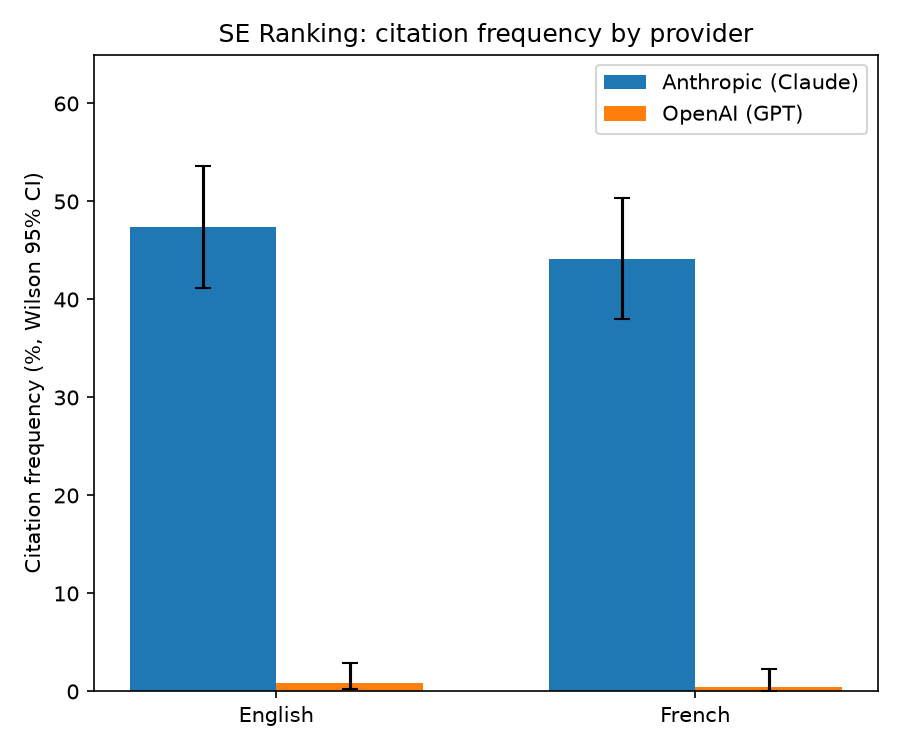
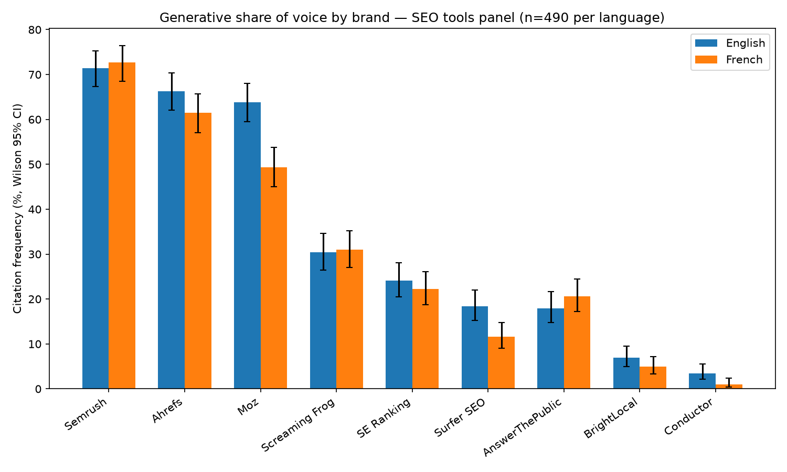

# GEO Brand Monitor - Generative Engine Optimization for the SEO Tools Market

*Measuring which brands large language models actually recommend, how often, and whether the answer depends on the language you ask in.*

🇫🇷 [Lire en français](README.fr.md)

---



## Why this project

A growing share of search no longer goes through Google. A B2B buyer asks ChatGPT or Claude directly, *"what's the best SEO tool for a small business?"*, and gets three names back. No results page, no ranking, no second page.

For a brand, that raises a question traditional SEO can't answer: **am I cited in those answers, how often, and does it change depending on which model is asked or which language is used?**

Today this question is mostly handled with screenshots: ask once, look at the answer. That isn't a measurement, it's a coin flip. This project builds a reproducible pipeline to measure it properly, **Generative Engine Optimization (GEO)** / **Answer Engine Optimization (AEO)** applied to a real, verifiable market: the 11 leading **SEO & content tools** in B2B (Semrush, Ahrefs, Moz, and 8 others).

## Key findings

*(full numbers in `report/*.csv`; this is the short version)*

**1. A clear three-tier hierarchy, stable across both languages.** Semrush, Ahrefs and Moz form a dominant tier (60–73% citation frequency), with a sharp drop to Screaming Frog and SE Ranking (22–31%), and a long tail of brands with near-zero unprompted visibility (Conductor, Search Atlas, Nightwatch under 5%).

**2. The strongest signal in the whole dataset: a massive provider divergence on SE Ranking, consistent across both languages.**

| | English | French |
|---|---|---|
| Anthropic (Claude) | 47.3% [41.2%, 53.6%] | 44.1% [38.0%, 50.3%] |
| OpenAI (GPT) | 0.8% [0.2%, 2.9%] | 0.4% [0.1%, 2.3%] |

The confidence intervals don't overlap, in either language, this is a real, repeated provider bias, not sampling noise. Practical implication: a GEO strategy built around "optimizing for ChatGPT" alone would completely miss this brand's actual generative visibility on Claude.

**3. Moz and Surfer SEO are notably less visible in French than in English**, with non-overlapping confidence intervals (Moz: 63.9% EN vs 49.4% FR). Plausible hypothesis  **not proven here**  is a gap in French-language content/training data for these brands, worth testing further.

**4. A ceiling effect on the "specific use case" category**: Semrush is cited in 100% (70/70) of responses in both languages. A confidence interval touching 100% can't distinguish "genuinely always" from "≥ ~95%, sample too small to tell"  flagged here as a methodological limit, not an absolute result.

## What this means for a brand

**Measuring a single model isn't enough.** SE Ranking is cited in nearly one answer out of two by Claude, and almost never by GPT. A brand auditing only ChatGPT would believe itself invisible while being highly present elsewhere, or the reverse.

**Visibility in English doesn't carry over to French.** Moz loses 14 points of citation frequency between the two languages, and the gap is statistically significant. For a brand going international, generative visibility has to be measured market by market.

**A single query proves nothing.** Answers vary from one call to the next. Without repetition and confidence intervals, a screenshot can't tell you whether a brand is genuinely cited or whether it was luck.

**Scope, stated openly:** this tool measures, it doesn't prescribe. It tells you where a brand stands in generative answers at a given moment. It doesn't tell you what to do to improve that score. Measure properly before optimizing.

## Methodology

**Market chosen:** SEO tools, B2B a market small enough to have a clean, closed set of well-known brands (11), and one I have enough hands-on context in to sanity-check whether a model's answer is plausible or nonsense.

**Question panel:** 70 questions (35 in English, 35 in French each pair is an exact translation of the other, so the language comparison isn't confounded by asking different things). Split across 5 intent categories:

| Category | Count/lang | Example |
|---|---|---|
| Direct recommendation | 10 | *"What SEO tool would you recommend for a small business?"* |
| Brand-to-brand comparison | 8 | *"Semrush vs Ahrefs, which one should I pick?"* |
| Alternative-to-X | 7 | *"What's a cheaper alternative to Semrush?"* |
| Specific use case | 5 | *"What tool tracks local SEO rankings across multiple cities?"* |
| Open-ended category question | 5 | *"What are the best SEO tools in 2026?"* |

**Non-determinism, handled properly:** LLM outputs vary between calls. Each question was repeated **7 times** per provider. Results are expressed as a **citation frequency with a Wilson confidence interval**, never as binary presence/absence  the classic normal-approximation interval breaks down (can exceed 100%) at this sample size, so `statsmodels.stats.proportion.proportion_confint(..., method='wilson')` is used throughout.

**Models queried:** OpenAI (`gpt-4o-mini`) and Anthropic (`claude-haiku-4-5`)  two different providers, deliberately using cost-efficient "mini" tiers, which are also what most users interact with in free/standard usage.

**Extraction:** raw text answers are parsed into structured data (brands cited, order of appearance, sentiment, sources cited) by a second, temperature-0 LLM call constrained to a closed list of the 11 known brands  with a code-level normalization/validation layer afterward, because the extractor didn't perfectly respect the closed list in practice (see [Limitations](#limitations)).

## Pipeline

```
questions_panel.csv
      │
      ▼
query_models.py        → data/raw_responses/*.json   (980 calls: 70 questions × 2 providers × 7 reps)
      │
      ▼
extract_mentions.py    → data/extracted/*.json        (structured brand mentions)
      │
      ▼
analyze.py              → report/*.csv                (citation frequency + Wilson CI, at 3 levels of granularity)
```

Design choices worth calling out:
- **Idempotent by file** : each API call/extraction writes its own JSON file and is skipped if it already exists, so an interrupted run resumes without re-paying for completed work.
- **Retry with backoff, isolated per call** : one failed call never takes down the run.
- **Self-citation filtering** :for "alternative" and "comparison" questions, the target brand is named in the question itself, so it appears in the answer almost by construction. That's an artifact of the prompt, not a real signal. All reports are generated both **raw** and **excluding self-citation**, and the `_excl_self` version is the one to trust for cross-category comparisons.

## Limitations

- **Closed brand list (11 brands).** Models frequently mention free/adjacent tools outside this list (Google Search Console, Ubersuggest, Yoast SEO...)  these are intentionally not counted, which likely **understates** the real citation share of the "free tools" category. This was a deliberate time/scope trade-off, not an oversight.
- **Extraction isn't perfectly reliable.** Despite an explicit closed-list instruction, the extraction model occasionally introduced out-of-scope brands (e.g. "BrightEdge", not in the panel) or inconsistent spelling of in-scope ones ("SEMrush" vs "Semrush"). A code-level normalization/validation layer was added as a safety net, a good illustration of why LLM output should never be trusted blindly downstream, even under a strict prompt.
- **Two providers, "mini" tier models only.** Results may differ with flagship models or additional providers (Google Gemini, Perplexity).
- **Small per-question sample (n=7).** Confidence intervals are wide at the individual-question level; all interpretation here is done at aggregated levels (n=245 or n=490) where intervals are tight enough to be meaningful.

## Reproducing this

```bash
pip install -r requirements.txt
cp .env.example .env   # fill in OPENAI_API_KEY and ANTHROPIC_API_KEY
python src/query_models.py
python src/extract_mentions.py
python src/analyze.py
```

Total cost for the full run (980 query calls + ~980 extraction calls, both on mini-tier models): well under $5.

## Repo structure

```
├── data/
│   └── questions_panel.csv       # the 70-question panel (35 EN + 35 FR, mirrored pairs)
├── src/
│   ├── query_models.py           # step 1: query both providers
│   ├── extract_mentions.py       # step 2: structure raw answers
│   └── analyze.py                # step 3: frequencies + Wilson CI
├── report/                       # generated CSVs (raw + excl-self-citation, 3 granularities)
└── requirements.txt
```

## Possible next steps

- Expand the brand list to capture free/adjacent tools, to test the "free tools understate" hypothesis directly.
- Add a third provider (Google Gemini) to see if the SE Ranking divergence is Anthropic-specific or a two-vs-one pattern.
- Track the same panel over time to see whether generative brand visibility shifts as fast as traditional SEO rankings do.

---

**About this project:** built independently to measure a phenomenon digital marketing is only starting to document. The code and full methodology are open, questions and feedback welcome.

Nada Chniter, Digital Project Manager · [LinkedIn](https://www.linkedin.com/in/nada-chniter/)
